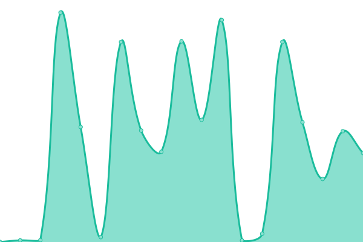

# [📈 Live Status](https://demo.upptime.js.org): <!--live status--> **🟥 Complete outage**

This repository contains the open-source uptime monitor and status page for [Upptime](https://upptime.js.org), powered by [Upptime](https://github.com/upptime/upptime).

With [Upptime](https://upptime.js.org), you can get your own unlimited and free uptime monitor and status page, powered entirely by a GitHub repository. We use [Issues](https://github.com/upptime/upptime/issues) as incident reports, [Actions](https://github.com/chinobing/upptime-rssinn/actions) as uptime monitors, and [Pages](https://demo.upptime.js.org) for the status page.

<!--start: status pages-->
<!-- This summary is generated by Upptime (https://github.com/upptime/upptime) -->
<!-- Do not edit this manually, your changes will be overwritten -->
<!-- prettier-ignore -->
| URL | Status | History | Response Time | Uptime |
| --- | ------ | ------- | ------------- | ------ |
|  [RSSinn小黑屋(主站)](https://rssinn.com) | 🟥 Down | [rs-sinn.yml](https://github.com/chinobing/upptime-rssinn/commits/HEAD/history/rs-sinn.yml) | 

 654ms
     
 | 

<a href="https://status.rssinn.com/history/rs-sinn">100.00%</a>
    

|  [toscrape(DEMO)](https://www.rssinn.com/toscrape/quotes) | 🟥 Down | [toscrape-demo.yml](https://github.com/chinobing/upptime-rssinn/commits/HEAD/history/toscrape-demo.yml) | 

 440ms
     
 | 

<a href="https://status.rssinn.com/history/toscrape-demo">100.00%</a>
    

|  [证监会 - 企业辅导信息(fudao)](https://rssinn.com/csrc/fudao) | 🟥 Down | [fudao.yml](https://github.com/chinobing/upptime-rssinn/commits/HEAD/history/fudao.yml) | 

 857ms
     
 | 

<a href="https://status.rssinn.com/history/fudao">0.00%</a>
    

|  [深交所 - IPO项目动态(szse_ipo)](https://rssinn.com/szse/ipo) | 🟥 Down | [ipo-szse-ipo.yml](https://github.com/chinobing/upptime-rssinn/commits/HEAD/history/ipo-szse-ipo.yml) | 

 1044ms
     
 | 

<a href="https://status.rssinn.com/history/ipo-szse-ipo">100.00%</a>
    

|  [科创板电报(chinastarmarket)](https://rssinn.com/chinastarmarket/telegraph) | 🟥 Down | [chinastarmarket.yml](https://github.com/chinobing/upptime-rssinn/commits/HEAD/history/chinastarmarket.yml) | 

 1566ms
     
 | 

<a href="https://status.rssinn.com/history/chinastarmarket">100.00%</a>
    

|  [36kr -实时快讯(newsflashes)](https://rssinn.com/36kr/newsflashes) | 🟥 Down | [36kr-newsflashes.yml](https://github.com/chinobing/upptime-rssinn/commits/HEAD/history/36kr-newsflashes.yml) | 

 1772ms
     
 | 

<a href="https://status.rssinn.com/history/36kr-newsflashes">0.00%</a>
    

|  [36kr -最新文章(latest)](https://rssinn.com/36kr/latest) | 🟥 Down | [36kr-latest.yml](https://github.com/chinobing/upptime-rssinn/commits/HEAD/history/36kr-latest.yml) | 

 1446ms
     
 | 

<a href="https://status.rssinn.com/history/36kr-latest">98.70%</a>
    

|  [同花顺实时快讯(10jqka-realtimenews)](https://www.rssinn.com/10jqka/realtimenews) | 🟥 Down | [10jqka-realtimenews.yml](https://github.com/chinobing/upptime-rssinn/commits/HEAD/history/10jqka-realtimenews.yml) | 

 346ms
     
 | 

<a href="https://status.rssinn.com/history/10jqka-realtimenews">100.00%</a>
    

|  [桥水（bridgewater）观察](https://rssinn.com/bridgewater/research) | 🟥 Down | [bridgewater.yml](https://github.com/chinobing/upptime-rssinn/commits/HEAD/history/bridgewater.yml) | 

 92ms
     
 | 

<a href="https://status.rssinn.com/history/bridgewater">100.00%</a>
    

|  [中国会计视野论坛(esnai)](https://rssinn.com/esnai) | 🟥 Down | [esnai.yml](https://github.com/chinobing/upptime-rssinn/commits/HEAD/history/esnai.yml) | 

 2990ms
     
 | 

<a href="https://status.rssinn.com/history/esnai">100.00%</a>
    

|  [迅雷电影天堂(xl720)](https://rssinn.com/xl720) | 🟥 Down | [xl720.yml](https://github.com/chinobing/upptime-rssinn/commits/HEAD/history/xl720.yml) | 

 11385ms
     
 | 

<a href="https://status.rssinn.com/history/xl720">90.15%</a>
    

|  [人人影视分享热搜(yyets-top)](https://rssinn.com/yyets/top) | 🟥 Down | [yyets-top.yml](https://github.com/chinobing/upptime-rssinn/commits/HEAD/history/yyets-top.yml) | 

 1941ms
     
 | 

<a href="https://status.rssinn.com/history/yyets-top">100.00%</a>
    

|  [人人影视分享-评论区资源-阿里云盘(yyets-discuss)](https://rssinn.com/yyets/discuss) | 🟥 Down | [yyets-discuss.yml](https://github.com/chinobing/upptime-rssinn/commits/HEAD/history/yyets-discuss.yml) | 

 90ms
     
 | 

<a href="https://status.rssinn.com/history/yyets-discuss">100.00%</a>
    

|  [留园网-搜索(6park-search)](https://www.rssinn.com/6park/search?kw=%E6%B5%B7%E8%B4%BC%E7%8E%8B) | 🟥 Down | [6park-search.yml](https://github.com/chinobing/upptime-rssinn/commits/HEAD/history/6park-search.yml) | 

 1260ms
     
 | 

<a href="https://status.rssinn.com/history/6park-search">100.00%</a>
    

<!--end: status pages-->

[**Visit our status website →**](https://demo.upptime.js.org)

## 📄 License

- Powered by: [Upptime](https://github.com/upptime/upptime)
- Code: [MIT](./LICENSE) © [Upptime](https://upptime.js.org)
- Data in the `./history` directory: [Open Database License](https://opendatacommons.org/licenses/odbl/1-0/)
